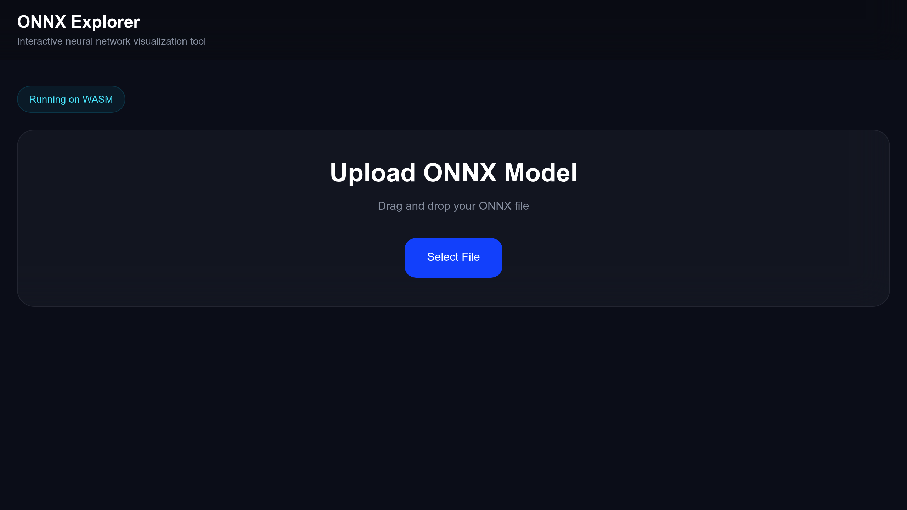

# ONNXLab

A browser-native ONNX model visualization and inference platform built with Next.js, React Flow, and ONNX Runtime Web.

> 🚀 **Live Demo:** [onnxlab.kgup.me](https://onnxlab.kgup.me)



---

## Features

### Interactive Graph Visualization

- Upload `.onnx` models directly in the browser
- Interactive, movable node graph with top-to-bottom layout
- Netron-inspired node inspector
- Tensor shape and type annotations on nodes
- Node attribute inspection
- Input/output tensor connections

### Runtime Model Parsing

ONNXLab parses models dynamically at runtime, extracting model inputs/outputs, tensor shapes and types, node attributes, and full graph structure.

### Dynamic Input System

Input UI is automatically generated from model metadata. Supports image tensors, vector tensors, and generic tensors — with automatic detection of dimensions, data types, and shape structure.

### Image Inference Pipeline

- Upload an image directly in the browser
- Automatic image → tensor conversion with dynamic resizing based on model input shape
- Fully client-side inference — no backend required

### Tensor Analysis

Automatically analyzes output tensors and displays type, shape, total values, min/max, and mean. Supports generic ONNX outputs.

### Prediction Viewer

Top-K prediction extraction with human-readable labels and raw tensor visualization. Upload an optional `labels.json` to map tensor indices to class names:

```json
["cat", "dog", "car", "person"]
```

Works with ImageNet, CIFAR, and any custom classification dataset.

---

## Tech Stack

| Layer      | Libraries                                    |
| ---------- | -------------------------------------------- |
| Frontend   | Next.js, React, TypeScript, TailwindCSS      |
| Graph      | React Flow, Dagre                            |
| ML Runtime | ONNX Runtime Web, WebAssembly, WebGPU        |

---

## Prerequisites

- **Node.js** v18 or higher
- **npm** v9 or higher
- A modern **Chromium-based browser** (Chrome 113+, Edge 113+) for full WebGPU support  
  > ⚠️ Firefox and Safari have limited or no WebGPU support. The app will fall back to WebAssembly automatically, but GPU-accelerated inference requires Chrome or Edge.

---

## Getting Started

```bash
git clone https://github.com/kshitijqwerty/onnxlab.git
cd onnxlab
npm install
npm run dev
```

Then open [http://localhost:3000](http://localhost:3000) in your browser.

---

## Usage

1. **Upload** any `.onnx` model file
2. **Explore** the graph — inspect nodes, view tensor metadata, analyze shapes
3. **Run inference** — upload an input image, optionally upload a `labels.json`, and run inference directly in the browser

---

## WebGPU / WASM Execution

ONNXLab uses both WebGPU and WebAssembly execution providers:

```js
executionProviders: ['webgpu', 'wasm']
```

It automatically uses GPU acceleration when available and falls back to WASM on unsupported devices. For best performance, use Chrome or Edge with hardware acceleration enabled.

---

## Supported Models

| Category         | Examples                                      |
| ---------------- | --------------------------------------------- |
| Classification   | ResNet, MobileNet, ViT, EfficientNet, CIFAR   |
| Object Detection | YOLO (v5, v8)                                 |
| Segmentation     | Segment Anything, DeepLab                     |
| NLP              | BERT, DistilBERT                              |
| Custom           | Any valid `.onnx` model                       |

---

## Project Structure

```
src/
├── app/
├── components/
│   ├── graph/
│   ├── inference/
│   ├── inspector/
│   └── uploader/
└── lib/
    └── onnx/
        ├── analyzeTensor.ts
        ├── checkWebGpu.ts
        ├── imageTensor.ts
        ├── inputType.ts
        ├── parseOutputs.ts
        ├── parser.ts
        ├── runInference.ts
        ├── softmax.ts
        └── topK.ts
```

---

## Roadmap

- [ ] Tensor heatmaps and embedding visualization
- [ ] YOLO bounding boxes and segmentation overlays
- [ ] Audio model support
- [ ] Performance benchmarking and tensor profiling
- [ ] Multi-model comparison
- [ ] Saved sessions and drag-and-drop workflow
- [ ] Cloud model hosting

---

## Contributing

Contributions are welcome! Please open an issue first to discuss what you'd like to change, then submit a pull request.

---

## License

MIT